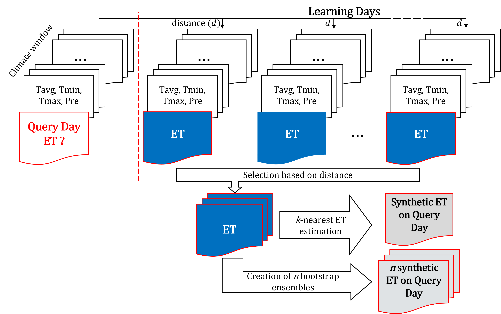

# Synthetic Image Time-series Generation using a kNN algorithm

## Introduction
The primary objective of this project is to generate synthetic image time-series through the implementation of a k-Nearest Neighbors (kNN) algorithm.
By leveraging various climatic, environmental, or remote-sensed variables, the algorithm can produce synthetic images of a specific variable or product for a defined time period.
The underlying mechanism involves learning from provided input data and subsequently generating synthetic images that align with the same variable or process.

The code encompasses multiple operational modes, each serving distinct purposes:
1. **Production Run**: In this mode, the algorithm is utilized for the generation of a given variable or product within a specified date range.
It is suitable for producing synthetic images for periods with missing actual data.
2. **Validation Run**: The validation mode adopts a leave-one-out cross-validation strategy and offers straightforward visualizations of the end results.
This enables an assessment of the algorithm's performance and the quality of the generated synthetic images.
3. **Optimization Run**: The algorithm integrates MATLAB's Bayesian Optimization Algorithm in this mode.
The objective is to optimize the parameters and fine-tune the algorithm for enhanced performance and precision.
This mode aids in achieving the best possible synthetic image outputs.

Through the combination of the kNN algorithm and diverse input variables, this project provides a powerful and flexible solution for generating synthetic image time-series, applicable to various domains like hydrology and remote sensing.

## Algorithm Overview
The proposed algorithm is a data-driven approach for generating synthetic image time-series based on existing data.
It is designed to address the challenge of producing synthetic images for query dates where actual data is unavailable.
The algorithm operates in two main phases, involving query dates and learning dates.

### Data Segmentation
The dataset is divided into two distinct subsets: the query dates and the learning dates.
The query dates represent time instances where data of interest is not available, and the objective is to generate synthetic images for these specific time points.
On the other hand, the learning dates encompass all available time instances with available data.

### Climate Window Selection
For each date in both the query and learning sets, a climate window is created by selecting a range of preceding days that encapsulate the relevant climate variables.
The climate window serves as a context for generating synthetic images, as it contains essential information related to the specific process or variable.

#### Climate Window Sizes
The algorithm considers two climate sub-windows for the kNN computation:
- **Short Window**: This window represents the *n* closest days from either the query date or the learning date.
It captures short-term influences on the process.
- **Long Window**: The long window includes the *n* days from the end of the short window until the last day of the climate window.
It accounts for long-term trends and patterns.

### Climate Predictor Weighting
To enhance the algorithm's performance, different weights are assigned to each climate predictor for both Short and Long Windows.
These weights are utilized during the kNN process to emphasize the significance of certain climate variables over others, allowing for better adaptation to specific processes or variables.

### k-Nearest Neighbors (kNN) Approach
The algorithm employs the k-Nearest Neighbors (kNN) method to find the most relevant learning dates for each query date.
For each query date's climate window, the distance to the climate window of every learning date is computed.
The learning dates are then sorted based on their proximity to the query date's climate window.
The *k* learning dates with the shortest distances are selected for further processing.

### Generation of Synthetic Images
After identifying the *k* nearest learning dates, the algorithm offers two distinct approaches for generating synthetic images:
- **Deterministic Image Generation**: In this mode, the *k* nearest learning dates are aggregated to create a single generic image for the query date.
This deterministic approach results in a single representative image.
- **Stochastic Image Generation**: In this mode, the *k* nearest learning dates are used to create *n* ensembles through a bootstrap algorithm.
Each ensemble represents a different plausible scenario.
Consequently, *n* stochastic synthetic images are generated for the query date, reflecting potential variations.

### Cross-Validation for Fine-tuning
The algorithm is fine-tuned using a cross-validation approach.
Different metrics can be employed as the evaluation metric to optimize the generated outputs.
This iterative process helps to adjust the algorithm's parameters and weights for optimal performance and accuracy.

(Note: The figure illustrates the graphical representation of the kNN algorithm)

## Requirements
To utilize the provided code for synthetic image time-series generation, the following prerequisites must be met:
1. **MATLAB**: The code is designed to be executed within the MATLAB environment.
2. **Parallel Computing Toolbox** (Optional): While the Parallel Computing Toolbox is not mandatory, its presence is highly recommended.
The toolbox can significantly enhance the computation speed and efficiency, particularly when dealing with large datasets.
3. **Preprocessing of Variables**: Before applying the code, it may be necessary to preprocess the various input variables appropriately.
Preprocessing could involve data cleaning, normalization, or other transformations to ensure the data is in a suitable format for the algorithm.
4. **NetCDF Files**: The code accepts NetCDF files as the input data format.
Ensure that your datasets are saved in the NetCDF file format.
5. **Consistent File and Variable Names**: It is crucial to maintain consistent file and variable naming conventions.
For instance, if dealing with an evapotranspiration product, the associated NetCDF file should be named `et.nc`, and the variable representing evapotranspiration should be labeled as `et`.

## Parameter Definitions
To generate synthetic image time-series, the parameters of the algorithm must be customised in the `CONTROL_PANEL.m` file.
The following table provides detailed descriptions of each parameter and examples of their respective values:

| Parameter Name | Description | Example Value(s) |
| --- | --- | --- |
| rawDir | Path to raw data directory | 'C:\path\to\raw\data\' |
| inputDir | Path to saved input data directory | 'C:\path\to\input\' |
| outputDir | Path to saved output data directory | 'C:\path\to\output\' |
| var | Variable(s) to be generated | ["et","sm"] |
| vars | Climatic variables | ["Tavg","Tmin","Tmax","Pre"] |
| addVars | Additional variables | ["MODIS"] |
| QdateStart | Start of generation period (YYYYMMDD) | 19500101 |
| QdateEnd | End of generation period (YYYYMMDD) | 19791231 |
| LdateStart | Start of learning period (YYYYMMDD) | 19800101 |
| LdateEnd | End of learning period (YYYYMMDD) | 20201231 |
| outputTime | Image generation timestep | 1 or 2 |
| precision | Precision | 1 or 2 |
| ensemble | *n* bootstrap ensembles | 10 |
| generationType | Generation type | 1, 2 or 3 |
| outputType | Output file type | 1 or 2 |
| coordRefSysCode | Coordinate reference system code | 4326 |

The `CONTROL_PANEL.m` file serves as a central configuration hub for controlling the different aspects of the code, tailored to meet specific requirements.
Here's a brief overview of the parameters:
- **rawDir**: Specifies the path to the directory containing the raw data necessary for the algorithm's operation.
- **inputDir**: Indicates the path to the directory where input data is saved.
- **outputDir**: Specifies the path to the directory where output data, including generated synthetic images, will be saved.
- **var**: A list of variable(s) to be generated as synthetic images.
For instance, ["et","sm"] represents evapotranspiration and soil moisture.
- **vars**: A list of climatic variables used in the algorithm, such as temperature (Tavg, Tmin, Tmax) and precipitation (Pre).
- **addVars**: Additional variables that may be considered during the image generation process, e.g., MODIS data.
- **QdateStart** and **QdateEnd**: Define the start and end dates of the generation period (**query dates**).
- **LdateStart** and **LdateEnd**: Set the start and end dates of the learning period (**learning dates**).
- **outputTime**: Specifies the timestep for image generation, where 1 represents daily and 2 represents monthly.
- **precision**: Refers to the level of precision desired, with 1 representing single precision and 2 representing double precision.
- **ensemble**: Indicates the number of bootstrap ensembles to create for stochastic image generation.
- **generationType**: Allows selection of the type of image generation: 1 for mode aggregation, 2 for mean aggregation, and 3 for median aggregation.
- **outputType**: Specifies the output file type, where 1 represents GeoTIFF and 2 represents NetCDF.
- **coordRefSysCode**: Defines the coordinate reference system code for spatial reference.

By adjusting these parameters in the `CONTROL_PANEL.m` file, users can tailor the algorithm's behavior to suit their specific use cases.
It provides a high degree of flexibility and adaptability for producing synthetic image time-series with different configurations and settings.

## Code Structure
The project is organized into several distinct files, each fulfilling specific roles in the process of synthetic image time-series generation.
The primary components of the project are as follows:
- `CONTROL_PANEL.m`: This file serves as a central configuration module for the algorithm.
It contains all the parameters required for customizing the behavior of the image generation process.
- `MAIN.m`: The main script that orchestrates the entire workflow by calling various functions to generate synthetic image time-series.
- `ConvertNetCDFtoStructure.m`: This script reads NetCDF files and converts the data into MATLAB structures.
- `extractGeoInfo.m`: A function responsible for extracting projection information from NetCDF files.
- `extractClimateData.m`: This function creates an array of climate variables extracted from the input datasets.
- `ConvertStructureToQueryDates.m`: A function that generates the queryDates array.
The queryDates array is a critical element in the algorithm, representing the specific dates for which synthetic images are to be generated.
- `extractAdditionalVars.m`: This function creates the additionalVars array, which includes any supplementary variables that might contribute to the image generation process.
- `createWeights.m`: An optional script that creates generic weights of 1 for all climatic variables.
Can be bypassed if an optimisedWeights table is provided.
- `KNNDataSorting.m`: The main computational component of the code.
This script performs the kNN computations and sorts the learning dates based on their distance to the query dates' climate windows.
- `GenerateSynImages.m`: A script responsible for creating files and downloading the synthetic images generated by the algorithm.
- `validationMetrics.m`: Used exclusively in the validation run, this function computes the selected metric for assessing the quality and accuracy of the generated synthetic images.
- `visualiseMetrics.m`: Exclusive to the validation run, this script provides visualizations of the metric results, aiding in the evaluation of the algorithm's performance.

## Author
Loïc Gerber (loic.gerber.2@unil.ch) - PhD Student, University of Lausanne, Switzerland
